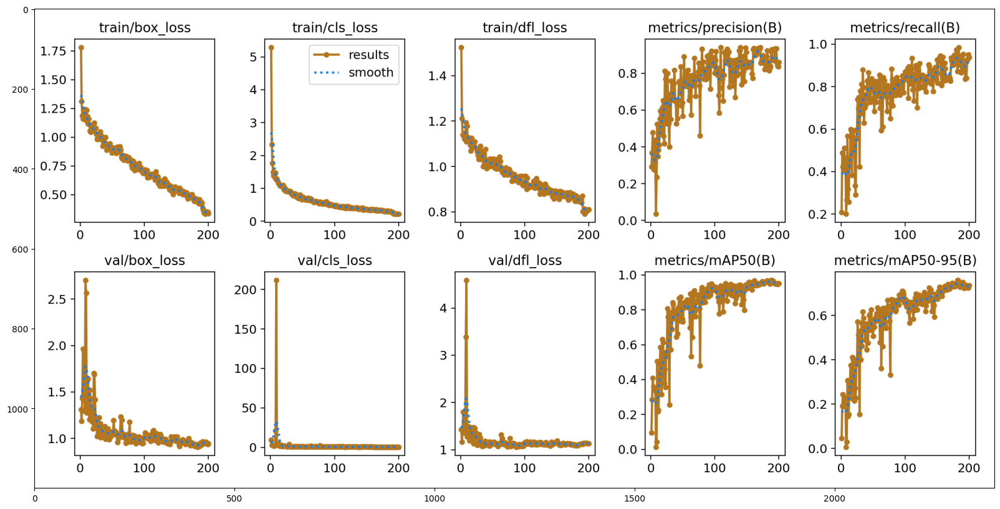
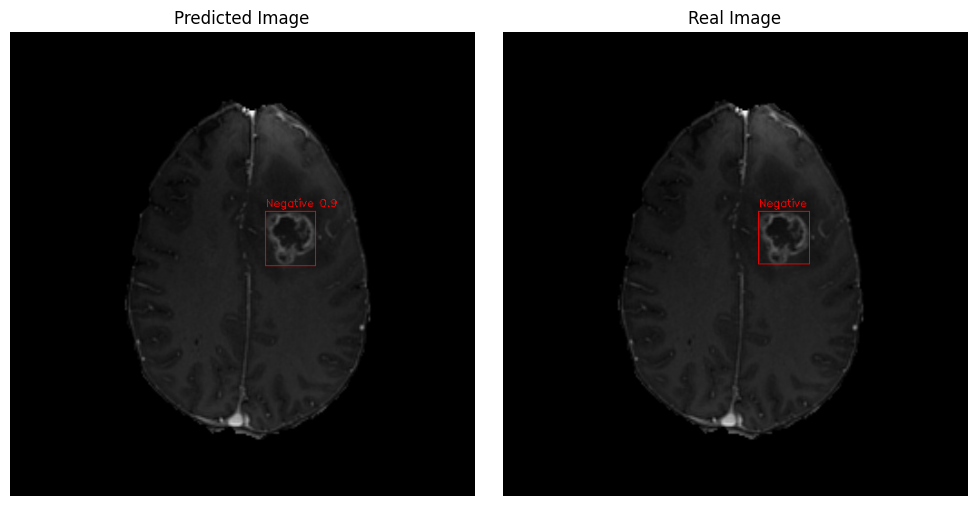

# Brain Tumor Detection with YOLOv8

This repository provides a comprehensive guide for training the YOLOv8 model using Ultralytics for the detection of brain tumors in MRI images.

## Dataset
The dataset comprises MRI images of the brain, with annotations indicating the presence and location of tumors. The images are preprocessed and organized into appropriate directories for training the YOLOv8 model.

## Training
The YOLOv8 model is trained on the dataset using Ultralytics, a powerful deep learning library for object detection tasks. The training process involves configuring the model architecture, optimizing hyperparameters, and fine-tuning the model for accurate tumor detection.

## Usage
To use the trained YOLOv8 model:
1. Clone the repository to your local machine.
2. Install the necessary dependencies, including PyTorch and Ultralytics.
3. Train the YOLOv8 model using the provided scripts or notebooks.
4. Evaluate the model's performance and visualize the detection results.

## Results
The trained YOLOv8 model should be able to accurately detect brain tumors in MRI images. The detection results can be visualized and analyzed to assess the model's performance and effectiveness in clinical applications.

### Learning & Loss Curves

### Result
